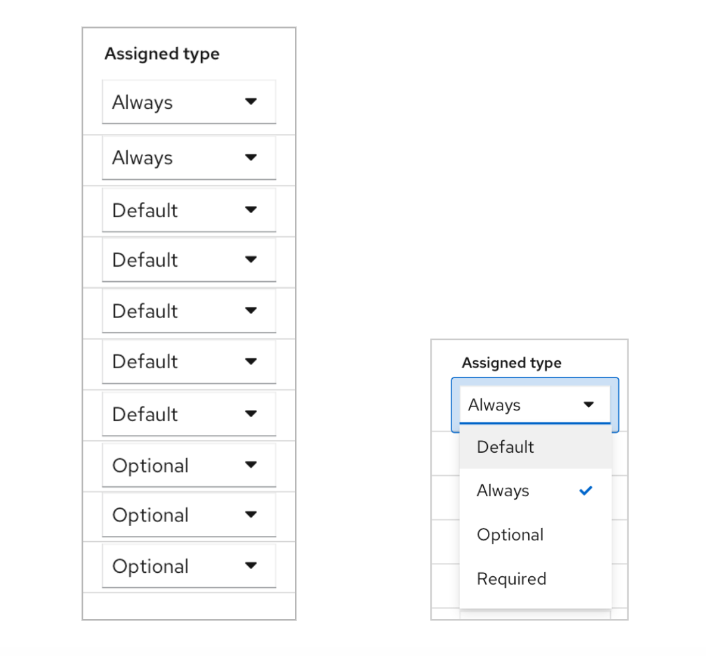

# Client Scopes - Setup tab

For the Setup page in Client scopes of a Client, we got rid of the old patterns and used PF4 tables to display all the Assigned client scopes. Also, I added a column of description for each client scope, which allowed users to add some descriptions while creating new client scopes.

As for adding available client scopes, click the blue Add button and choose target client scopes in a pop-up Modal page, the current client scopes have 4 types(always, default, optional, required). Users can select multiple client scopes and add them to one of these 4 types.

## Layout improvements

* The landing page displaying all the assigned client scopes in a table format.
* Add a Description column for each client scope.

* Use Modals as a new way of assigning available scopes.

## Function changes

* Users are able to change the assigned type for each client scope in the table.

* Change type for multiple client scopes in a Modal （Click on kebab menu)

